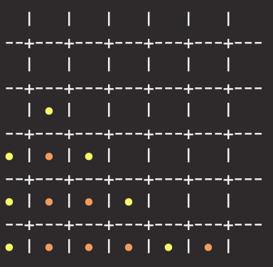

# Connect 4 Neural Network

Attempt to train a neural network with Tensor Flow to play and win Connect 4.
This project is based on the work by Carl Friedrich, where a several types of neural network learn to play tic-tac-toe. More info at https://github.com/fcarsten/tic-tac-toe.

## Visual Interface
The state of a game can be printed in console showing an output similar to the following:

## Neural Network Results
So far, using a simple neural network with Q-Learning the results are as follows:
Notice: player 1 is the trained neural network

Using a more advanced aNN (Experience Replay + Gradient Descent) that was trained against a limited random minmax algorithm the results against human players improved. Below is a showcase of the aNN (RED) playing a limited minmax algorithm of depth 3 (YELLOW):

## To be continued..
user interface to be added in order to play against the trained neural network.
