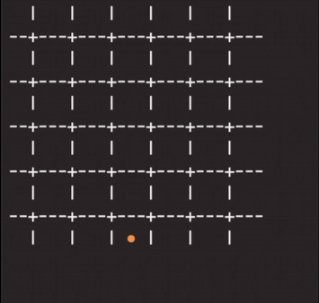

# Connect 4 Neural Network

Attempt to train a neural network with Tensor Flow to play and win Connect 4.
This project uses the work by Carl Friedrich as baseline, where several types of artificial neural network (aNN) learn to play tic-tac-toe (More info at https://github.com/fcarsten/tic-tac-toe), yet adapts the game and machine learning processes to deal with the complexities of Connect 4.

## Game Mechanics and Visual Interface
Connect 4 is a game for 2 players where the board is a matrix of 7x6 and the winner is the one who can place four chips of the same color in a vertical, horizontal or diagonal line.
The state of a game can be printed in console showing an output similar to the following:
 

## Neural Network approcahes

### Simple Neural Network vs Random player
Using a simple neural network with Q-Learning and no memory buffer playing against a program that played randomly took about 5 minutes to complete after playing 100 games for 200 generations (20,000 in total), the results are shown below:
*Notice: player 1 is the trained neural network.*
 

 
Although the output looked promising, I could easily beat the neaural network playing against it for less than 12 moves.
I needed to take a better approach both in the model used as well as the opponent to play against.

### Memory Neural Network vs MinMax algorithm
Using a more advanced aNN (Experience Replay + Gradient Descent) trained against a limited random minmax algorithm took about 12 hours to complete in my MacBook Pro after playing playing 100 games for 500 generations (50,000 in total). Results are shown below:
*Notice: player 1 is the trained neural network.*
 

 
The vast difference in training time is due to the nature of the MinMax Algorithm, which exhausts every possible move variation before making a choice. The Minmax implemented here limited the depth of the algorithm due to the enormous amount of states in Connect 4.
On the other hand, the neural network per se was more complex, holding a memory buffer that would help rebalance its weights executing longer processes, compared to the simple neural network used before.

With the new aNN, the results against human players improved. But first, let's see below a showcase of the aNN (RED) playing a limited minmax algorithm of depth 3 (YELLOW):
 

 
Now, battling against human players, the aNN could corner its opponents as shown in the image below. The human (YELLOW), who moves next, by playing on the 2nd column would force a win for the aNN (RED) as shown by the red dashed horizontal line; and by playing on the 6th column (the other only option for the human player), would yield a win for the aNN as shown by the red dashed diagonal.
 

 
Moral of the story: We got a pretty decent aNN that can play Connect 4 against humans by using TensorFlow and Keras technology :)
